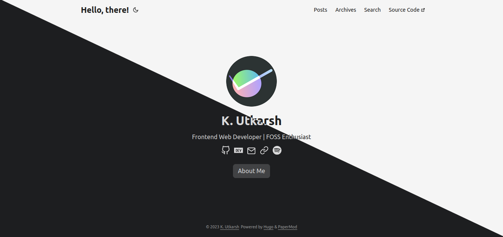

<!-- Shields -->
[![MIT License][license-shield]][license-url]

<!-- Logo & Heading  -->

 

  

  <h2 align="center">K. Utkarsh's Website Repository</h3>

 

<!-- Acknowledges libraries/frameworks used in development -->
### Built With
The Following major libraries and frameworks helped bootstrap the project:

* 
* 
* 
* 

[license-shield]:https://img.shields.io/static/v1?label=LICENSE&message=MIT&color=blueviolet&style=for-the-badge
[license-url]: [https://github.com/KodeCrumbs/kode-crumbs-hs.github.io/LICENSE](https://github.com/Code-Crumbs-HS/code-crumb-site/blob/main/LICENSE)
